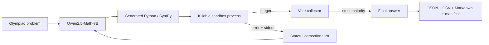

# ALPHA-MATH

**An offline, tool-integrated math reasoning agent with stateful repair, hard process isolation, reproducible sampling, and auditable evaluation.**

ALPHA-MATH targets integer-answer olympiad problems under Kaggle-style constraints:
local open weights, one GPU, no external LLM API, and no network at inference.
Qwen2.5-Math generates an exact Python/SymPy program; a restricted worker executes
it; failed programs receive their original problem, previous code, stdout, and
error for correction; independent successful answers are aggregated by strict
majority.

> **Evidence status:** engineering is covered by automated regression tests.
> A **real** Qwen2.5-Math-7B Kaggle run is frozen at
> [`results/kaggle_runs/v1_real_qwen_sample10/`](./results/kaggle_runs/v1_real_qwen_sample10/)
> — **90% (9/10)** on the bundled 10-problem sanity set (not a public leaderboard).
> Mock accuracy is never presented as model intelligence.

## Why this is more than a notebook wrapper

- **Stateful self-repair:** correction turns retain the original problem, prior
  model response, captured stdout, and execution error.
- **Killable sandbox workers:** every program runs in a fresh process with a real
  wall-clock timeout, AST policy, output/source caps, and a Unix memory limit.
- **Deterministic experiment identity:** seeds are derived per vote and correction;
  config, package versions, GPU details, Git commit, and dataset path are recorded.
- **No silent demo fallback:** a Transformers run fails loudly if weights or GPU
  dependencies are unavailable. Mock mode must be selected explicitly.
- **Checkpointed competition inference:** a valid partial submission and complete
  trace are written after each problem.
- **Ablation-ready:** one flag compares pass1, repair, and repair+majority voting
  using the same model, data, sandbox, and seed policy.
- **Portfolio-grade artifacts:** each evaluation creates JSON traces, a flat CSV,
  a Markdown report, and a downloadable evidence ZIP.

## Runtime architecture



Each of `k` vote rounds performs one initial generation and at most
`max_corrections` repairs. A strict majority ends sampling early because the
result can no longer be overturned. Failed samples do not become votes, and all
fallbacks/ties/timeouts remain visible in the report.

## Current validation

| Evidence | Status | What it proves |
|---|---:|---|
| Regression suite | **17/17 passing locally** | repair context, attempt semantics, seeds, voting, parser, reports, resume, import policy, output cap, hard timeout |
| CPU mock integration | Available | module/config/sandbox plumbing only |
| **Real Qwen labeled run (Kaggle T4)** | **Done — frozen** | end-to-end offline inference + agent loop on open weights |
| Headline accuracy | **90% (9/10)** | on **bundled sanity** problems only (`data/sample_problems.json`) |
| Artifact path | [`results/kaggle_runs/v1_real_qwen_sample10/`](./results/kaggle_runs/v1_real_qwen_sample10/) | `run_manifest.json`, evaluation JSON/CSV/MD, preflight, tests log |
| Hardware / load | Tesla T4 · Transformers · **4-bit** | matches Kaggle portfolio demo constraints |
| Repair/vote ablation | Optional (`RUN_ABLATION=True`) | mechanism contribution (not in this freeze) |
| Public leaderboard score | **Not claimed** | 10 demos ≠ AIMO LB |

### Real-run snapshot (honest)

| Metric | Value |
|--------|------:|
| Correct | 9 / 10 |
| Accuracy | **90.00%** |
| Execution success | 90.00% |
| Mean vote agreement | 96.30% |
| Avg latency | ~84 s / problem |
| Failed id | `demo_10` (default answer 0 after code errors) |

Read the freeze notes: [`results/kaggle_runs/v1_real_qwen_sample10/NOTES.md`](./results/kaggle_runs/v1_real_qwen_sample10/NOTES.md).

Run the local regression suite without pytest:

```bash
python -m unittest discover -s tests -v
```

After installing core dependencies, run the explicit mock integration test:

```bash
python scripts/run_eval.py \
  --config configs/smoke_mock.yaml \
  --preflight \
  --artifacts-dir results/smoke_run \
  --zip-artifacts
```

The generated report labels itself **MOCK PIPELINE TEST — NOT MODEL QUALITY**.

## Quick start

### Lightweight CPU tooling

```bash
python -m venv .venv
# Windows: .venv\Scripts\activate
# Linux/macOS: source .venv/bin/activate
pip install -r requirements/core.txt
python scripts/run_preflight.py --config configs/smoke_mock.yaml
python scripts/run_eval.py --config configs/smoke_mock.yaml
```

### Real local model

```bash
pip install -r requirements/gpu.txt
python scripts/download_math_model.py
python scripts/run_preflight.py --config configs/default.yaml
python scripts/run_solve.py \
  --config configs/default.yaml \
  --model-path models/qwen2.5-math-7b-instruct \
  -p "What is gcd(252, 105)?"
```

For NF4/8-bit loading on Linux, install `requirements/quantization.txt` and set
`llm.load_in_4bit: true`.

## Kaggle: code upload to final evidence ZIP

This repository includes a generated upload package and an auditable notebook:

- `kaggle/AlphaMath_Kaggle_Upload_Package.zip` — final package to extract locally
- `kaggle/AlphaMath_Kaggle_Bundle.zip` — attach this inner ZIP as a Kaggle Dataset/Input
- `notebooks/alphamath_portfolio_kaggle.ipynb` — run cells in order
- `kaggle/README_FIRST.md` — short upload checklist
- `kaggle/runtime_dataset/` — private Dataset payload for the Kaggle CLI
- `kaggle/kernel/` — private GPU Kernel entrypoint and metadata

Build or refresh the code archive locally:

```bash
python scripts/build_kaggle_bundle.py
```

Extract the outer upload package once. Import its `.ipynb` through Kaggle's
notebook UI, then attach the inner code ZIP/Dataset and Qwen weights. For
meaningful accuracy, also
attach a labeled JSON, JSONL, or CSV benchmark with a problem/question column and
an answer/gold column. The notebook auto-discovers inputs but exposes exact path
overrides in its first code cell.

For an automated run, the bundle builder also refreshes the ignored ZIP inside
`kaggle/runtime_dataset/`; the matching private script in `kaggle/kernel/`
runs regression tests, discovers attached offline weights, and produces the same
artifact contract. Exact CLI commands and update behavior are documented in
`docs/KAGGLE.md`.

The final cell creates:

```text
/kaggle/working/alphamath_artifacts.zip
```

That archive contains:

```text
FINAL_REPORT.md
run_manifest.json
preflight.json
evaluation/
  REPORT.md
  evaluation.json
  per_problem.csv
  run_manifest.json
ablation/                 # when RUN_ABLATION=True
  ABLATION.md
  ablation.csv
submission.csv            # when competition test.csv is attached
submission_trace.json
```

Only copy a metric into a public README when its `run_manifest.json` says
`backend=transformers` and identifies a labeled dataset. The bundled ten problems
are a sanity set, not an olympiad benchmark.

## Reproducible evaluation input

Accepted schemas:

```json
[
  {
    "id": "example-001",
    "problem": "Problem statement...",
    "answer": 314,
    "difficulty": "hard",
    "tags": ["number-theory"],
    "source": "licensed-benchmark-name"
  }
]
```

CSV aliases are supported: `problem|question|prompt|text` and
`answer|gold|target|label`. Do not publish benchmark questions unless their
license permits redistribution; the report can reference an attached dataset
path without copying the source dataset into this repository.

## Experiment design

The optional ablation holds model, dataset, sampling seed, sandbox, and answer
normalization constant:

| Variant | Initial generations | Corrections | Aggregation |
|---|---:|---:|---|
| `tool_pass1` | 1 | 0 | single answer |
| `tool_repair` | 1 | 2 | single answer |
| `tool_repair_vote` | up to 3 | 2 each | strict majority |

The report compares accuracy, execution success, average attempts, latency, vote
agreement, and delta versus pass1. This tests whether additional inference compute
actually adds value instead of assuming that it does.

## Sandbox threat model

The worker:

- rejects imports in the final AST and rewrites only known math imports;
- blocks dangerous builtins, dunder traversal, filesystem/process/network names,
  and dynamic attribute helpers;
- caps source and captured output;
- kills the worker on timeout;
- applies an address-space limit on supported Unix systems.

It is appropriate for trusted model-generated math code in a local/Kaggle
pipeline. It is **not** a multi-tenant security boundary. A public service should
add a networkless container or microVM plus OS/cgroup/seccomp controls.

## Repository map

```text
AlphaMath/
├── README.md                 # you are here
├── LICENSE
├── pyproject.toml
├── requirements.txt          # → requirements/core.txt
├── .env.example
│
├── requirements/             # core / dev / gpu / quantization
├── configs/                  # default, kaggle, smoke_mock YAML
├── data/                     # sample problems + templates
├── models/                   # local weights (gitignored; see README)
├── src/                      # agent, sandbox, eval, reporting
├── scripts/                  # CLIs and Kaggle bundle builder
├── tests/                    # regression suite
├── notebooks/                # Kaggle portfolio notebook
├── kaggle/                   # upload checklist, kernel, dataset helpers
├── results/                  # summaries + frozen Kaggle runs
│   └── kaggle_runs/v1_real_qwen_sample10/
├── docs/                     # design, Kaggle, roadmap, changelog
└── .github/                  # CI
```

## Honest limitations and next evidence

- No custom fine-tuned weights are shipped; this project is **inference + agent
  engineering**, not a claim that we trained the 7B model.
- The frozen **90%** result uses **10 bundled demo problems** (`bundled_sanity`).
  It is a **pipeline + model sanity check**, not an olympiad leaderboard score.
- Weights on Kaggle were loaded from a public input dataset
  (`mehedi457/qwen25-math-7b-instruct`); inference stayed offline / local files.
- Dependency bootstrap on Kaggle may use network **once** to install packages
  (e.g. bitsandbytes); it does **not** call external LLM APIs.
- Python AST filtering is defense-in-depth, not perfect isolation.
- The T4 profile loads the 7B checkpoint in **4-bit** to preserve VRAM; report
  that together with accuracy.
- Next upgrades: larger labeled benchmark, tool-vs-no-tool ablation, and (only if
  earned) a competition submission score with full traces.

## Portfolio summary

> Built an offline tool-integrated math reasoning system using open-weight
> Qwen2.5-Math-7B, killable restricted execution, stateful error-driven repair,
> self-consistency voting, and auditable Kaggle evaluation — **90% on a 10-problem
> real-GPU sanity set**, with full manifests (not a fabricated leaderboard claim).

## License

Code is MIT licensed. Model weights and external benchmarks retain their own
licenses. Bundled sanity problems are original and are not presented as a public
benchmark.
